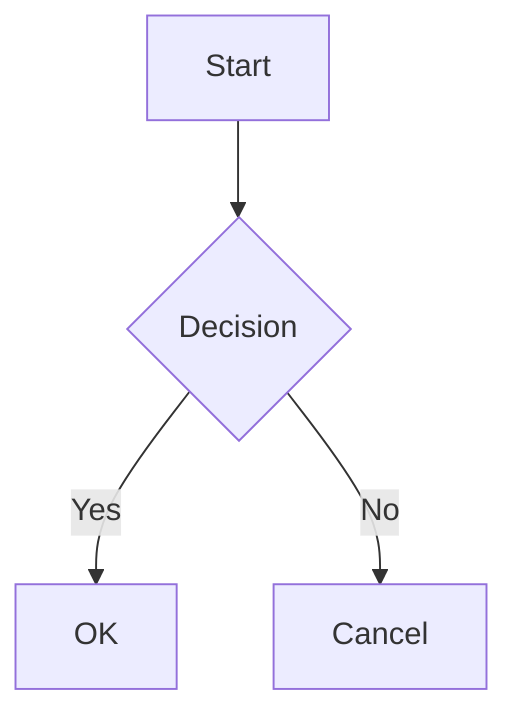

---
# Ma deuxième note

Cette note est liée à [[exemple1|Ma première note]].

## Fonctionnalités de Quartz

Quartz supporte plusieurs fonctionnalités intéressantes :

1. Les équations LaTeX : \[ E = mc^2 \]
2. Les diagrammes Mermaid :



3. La coloration syntaxique :

```python
def hello_world():
    print("Hello, World!")
``` 